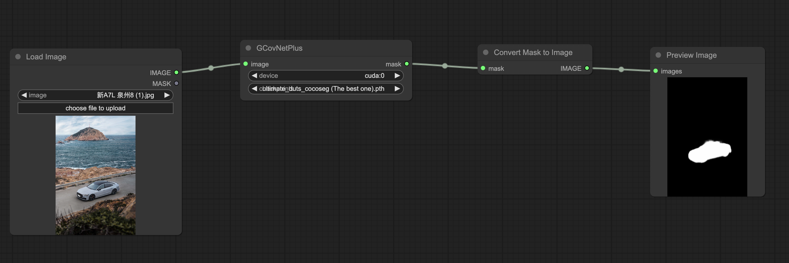
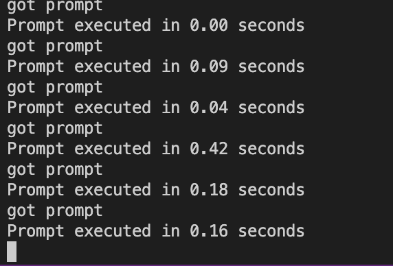

# ComfyUI-GCoNet-plus

## Introduction

Group collaborative learning network, termed GCoNet+, which can effectively and efficiently co-salient objects in natural scenes. This repo pack GCoNet-plus as ComfyUI nodes, and make this fast SOTA model easier use for everyone. 

In the first runtime, it needs `2.37`  secodns for checkpoint loading and move to `device`. Then each image image required less time for inference, depends on you inference device. 

## Installation

1. Go to comfyUI custom_nodes folder, `ComfyUI/custom_nodes/`
2. `git clone https://github.com/viperyl/ComfyUI-GCoNet-plus.git `
3. `pip install requirements.txt`

## Checkpoints Download

Make sure you have intall `git lfs`

1. go to comfyUI models folder, `ComfyUI/models/`
2. `git clone https://huggingface.co/ViperYX/GCoNet_plus_checkpoints`

## Usage

The demo workflow placed in `workflow/example_workflow.json`

inference speed screenshot. batch mode can also speed up inference time, but i still have no idea how to present this function.

## Others 

This model is designed for fast detection, so the model inference speed is incrediable high.  But I havn’t encoutnered any scenario that needs such high inference speed, so I only did very basic development on this repo. If you have any ideas or enhancments, please let me know, i am happy to do it. In the final, if this repo helped you, pleas give a star to the model author [GCoNet_plus](https://github.com/ZhengPeng7/GCoNet_plus)

